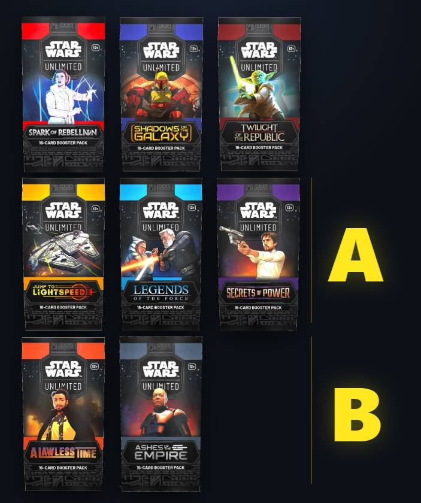

# RYCHLÝ PRŮVODCE SVĚTEM STAR WARS UNLIMITED

## Co je Star Wars Unlimited?

Star Wars Unlimited (nadále zkráceně SWU) je sběratelská karetní hra (TCG) zasazená do světa Star Wars.
Každý hráč vede svůj balíček prostřednictvím leadera, buduje své zdroje, vykládá jednotky na bojiště a snaží se zničit soupeřovu základnu dříve, než soupeř zničí tu jeho.
Nejčastěji se hraje ve formě duelu dvou hráčů, kdy každý má jednoho leadera, ale existuje i formát určený pro tři až čtyři hráče (Twin Suns), kde každý hráč hraje se dvěma leadery.

## Historie edic a rotace

Hra vyšla v březnu roku 2024 první edicí Spark of Rebellion (SOR), po které následovala v červenci téhož roku edice Shadows of the Galaxy (SHD) a v listopadu Twilight of the Republic (TWI). Ty tvoří takzvaný první rok.
V březnu 2025 pak vyšla edice Jump To Lightspeed (JTL), v létě Legends of the Force (LOF) a na podzim Secrets of Power (SEC), což jsou edice, jež mají na kartách uvedené písmeno A a tím se vyznačují do jaké rotace patří.
V březnu 2026 vyšla edice Lawless Time (LAW), jejíž karty už mají na sobě označení písmenem B. Do této rotace patří i v červenci vydaná edice Ashes of the Empire (ASH).

## Formáty hraní

Hra dvou hráčů se dá rozdělit do dvou specifických směrů a to **Constructed** a **Limited**. V Constructed hrají hráči se svými připravenými balíčky, kdežto v Limited si ten balíček teprve na akci vytvářejí.
Co se týče Constructed, tak zde obecně platí, že se hraje s balíčkem o padesáti kartách, který může využívat maximálně tři stejné karty. Za hlavní a nejhranější směr se dá považovat formát **Premier**, ve kterém se smí používat jen karty z posledních dvou aktuálních rotací. V této době je tak možné používat karty z rotace A a B. První tři edice (ještě bez označení) nejsou v tomto formátu povolené.
K tomu, aby šlo starší karty i nadále používat, je určen hlavně, ale nejen, formát **Eternal**, kde je možné hrát karty všech edicí dohromady, i když již i ten má své omezení, protože některé karty v něm již není možné kompetitivně používat (kuriozně jde o karty z edice JTL hratelné stále v Premier formátu).

Druhý specifický směr je **Limited**, který se dá rozdělit na dva podformáty a to **Sealed** a **Draft**. V těchto formátech si hráči nenosí vlastní decky, ale staví si o něco menší balíček (30 karet) a to jen z karet, které na místě obdrží. Následně se pak utkávají v již tradičně probíhajících duelech. Ve stručnosti je sealed formát založen na tom, že hráč obdrží šest balíčků (od Homeworlds i osm u větších eventů), které otevře a ze kterých pak následně staví svůj herní balíček. U draft formátu hráči otevřou postupně tři balíčky, ze kterého pak postupně odebírají po jedné kartě a zbytek posílají dalším hráčům. 

Hodně specifický formát je **Trilogy**, který vyžaduje vytvořit tři balíky s třemi různými leadery s omezením maximálně tři stejných karet na všechny tři decky. Na začátku si hráči navzájem jeden deck vyřadí a pak postupně musí vystřídat ten deck, jenž v předchozím kole vyhrál. Tudíž, aby celkově zvítězil, musí vyhrát s oběma decky.

Další celkem oblíbený formát je **Twin Suns**, kde je možné používat všechny karty všech edic, ale s omezením, že každá z karet se v balíčku o minimálně osmdesáti kartách nachází jen jednou. Jde o spíše o zábavný formát, kde hrají tři až čtyři hráči proti sobě a hra končí v té fázi, kdy je zničena některému hráči základna.
Na jaře 2026 vyšly čtyři předpřipravené Twin Suns decky, které obsahují speciální karty (označené TS26), které je ale možné legálně využívat jen v Twin Suns formátu a v Eternalu.

## Co potřebuji k hraní aneb jak začít?

Nejjednodušší start je v dnešní době v podobě zakoupení jednoho ze **spotlight** decků. První tři edice měly ještě vlastní **starter** sety, které obsahovaly dva leadery s předpřipravenými balíčky, ale od edice JTL začaly vycházet s každou edicí dva samostatné spotlight decky, které obsahují vždy jednoho leadera s předpřipraveným balíčkem a jeden booster s náhodnými kartami dané edice.
Na podzim roku 2025 ještě vyšla v krabicové verzi hra **Intro Battle: Hoth**, jenž podobně jako původní starter sety, obsahuje dva leadery a předpřipravené balíčky. Ten je vyloženě vytvořený a určený k naučení hry. Nicméně karty v něm patří do rotace "A" a je tak možné je využívat i v constructed formátech.

## Co dál?

Pokud vás hra zaujala, pak je na vás, jakým způsobem se rozhodnete pokračovat. Můžete zkusit vylepšovat váš spotlight deck či si můžete vybrat nového leadera a pokusit se vytvořit si deck vlastní. K rozšiřování vaší zásoby karet můžete přistoupit více způsoby.

### Boostery

Nejpředpokládanější je formát dokupování booster packů, které obsahují vždy 16 karet. Jeho obsah se s edicemi postupně měnil, ale původně booster obsahoval jednoho leadera, jednu základnu, devět běžných (C) karet, tři neběžné (U) a jednu vzácnou (R) či legendární (L) kartu. Na konci pak bývala jedna foilová karta různé vzácnosti. Kromě foilových karet se náhodně objevovaly i hyperspace verze karet (HS) jejichž obrázek nebyl ohraničen a hodně ceněné pak byly hyperspace foil verze karet (především těch legendárních).
Nejvíce vzácné ale byly speciální **showcase** verze leader karet jež se v boosterech vyskytovaly velmi sporadicky (odhadem v jednom ze téměř tří set boosterů).
Cena základních boosterů se většinou pohybovala kolem sta korun.

Od edice JTL začali vydávat **Carbonite** balíčky, jež stály pětkrát více než tradiční booster, ale měli dříve i větší pravděpodobnost, že se v nich objeví showcase leadera (přibližně osmkrát). Počet karet zůstával stejný, akorát leader byl vždy minimálně v HS verzi a balíček obsahoval 7 foil karet, 5 HS karet, 2 HS foil karty a vždy jednu novou **Prestige** kartu, což byla artově odlišná varianta některé karty z edice a to v normální či foil verzi (dříve šlo jen o unit karty, nyní i eventy).
Některé Prestige karty byly navíc unikátně číslované, což výrazně zvyšovalo jejich cenu.

Od edice LAW došlo k výraznějším změnám. Přestaly se úplně dělat foil verze karet, díky čemuž se zavedla garance minimálně jedné HS verze karty a garance jedné HS foil karty v každém balíčku. Navíc se v každém osmnáctém balíčku mohla objevit i nefoilová prestige karta.
U Carbonite se pak snížila pravděpodobnost, že bude obsahovat showcase kartu (téměř třikrát), ale zvedl se počet HS foil a HS karet.

### Cardmarket

Pokud si hráč chtěl dokoupit specifickou chybějící kartu, pak v Evropě se stal obecně nejpoužívanější službou k nákupu [Cardmarket](https://www.cardmarket.com/en/StarWarsUnlimited). Jen je potřeba počítat, že ne všechny karty je možné sehnat u českých prodejců (lze filtrovat podle mnoha parametrů), takže nákup některých karet se může notně prodražit placením dražšího poštovného ze zahraniční. Obecně se ale doporučuje si nechat dražší zásilky posílat trackovanou službou.

### Eventy

Tím se pomalu dostáváme ke komunitní stránce.

### Prerelease

Vždy v prvních pár dnech před vydáním nové edice probíhají **prerelease** události / turnaje, které pořádají obchody a herny, které hru podporují a kde je možné zakoupit **prerelease box**. Ten obsahuje jak HS verzi obou leaderů ze spotlight decku, tak šest boosterů z nové edice. V rámci pořádaného prerelease turnaje, si pak hráči na místě tvoří balíček a hrají turnaj dle pravidel pro formát sealed. Je to jedinečná možnost se dostat ke kartám dříve než je oficiální den vydání.

#### Weekly

V těchto místech (prodejny/herny), které hru oficiálně podporují by se měly týdně pořádat pravidelné sešlosti. Na nich hráči hrají především to, co si domluví či pořadatel oznámí, ale v rámci vstupu mají obdržet speciální **weekly pack**, který obsahuje vždy tři weekly varianty standardních karet ze setu. Těch je celkem dvacet v klasické a stejných dvacet ve foil variantě. Všechny karty jsou stejně platné, jako ty z normálního setu.

#### Showdown

V rámci setu má obchod uspořádat showdown turnaj pro své hráče i hosty, kteří obdrží jak promo kartu, tak se utkají o hodnotnější ceny a speciální variantu karty ze setu, kterou obdrží podle svého umístění. Varianty jsou TOP 8, TOP 4, Finalist a Champion.

#### Planetary

Taktéž v rámci setu se u nás většinou pořádají dva či tři planetary turnaje, kam se sjíždějí i hráči z okolních zemí (formát si volí pořadatel) přičemž jde již o hodně kompetitivní událost, kde se dodržují pravidla mnohem přísněji než například u showdownu. Zde již musí být k dispozici oficiální judge. 
Od Top8 si úspěšní hráči znovu rozdělí specifickou kartu ze setu, první čtyřka obdrží speciální žeton iniciativy a vítěz obdrží podložku s nápisem Champion. Navíc získá dostatek bodů, aby se mohl oficiálně přihlásit na galaktický šampionát (viz níže). 
 
#### Sector a Regional

V rámci setu se pak celosvětově pořádají tři středně velikostně zaměřené **Sector** kvalifikace a jedna velká **Regional** kvalifikace. Obdobně jako u Planetary i tady dostávají hráči karty dle umístění, vítěz Champion podložku, ale všichni účastníci obdrží specifické ceněné karty či předměty (podložky) jen za samotnou (placenou) účast a případně pak i další odměny za postup turnajem.
Během turnaje se navíc pořádají boční eventy, za jejichž hraní získávají hráči možnost získat další odměny z price wall. I tyto turnaje bývají dodatečně placené. Ale například jen zde se dá získat (black či silver) balíčky obsahující ceněné varianty karet ze setu, obdobu weekly.
V červnu 2026 došlo k pozměnění udělování bodů za umístění, ale došlo i k omezení, že **Regional** kvalifikace se bude nově pořádat jen jednou do roka a to v Evropě. Navíc byl stanoven strop bodů, které je možné získat jen z planetary kvalifikací na 500.

#### Galactic

Jednou za rok, zpravidla na konci července, se pak v Las Vegas pořádá galaktický šampionát, což zůstává nejvyšším vrcholem kompetitivní SWU scény, do jehož hlavního turnaje se musí hráči kvalifikovat získanými body z planetary, sector a regional kvalifikací. Šestnáct hráčů s největším počtem získaných bodů z těchto kvalifikací má cestu a ubytování hrazené pořadatelem. 
I zde se v rámci turnaje pořádají menší boční eventy pro všechny hráče s možností získat hodnotné ceny. 
Galaktický šampionát se pořádal zatím dvakrát, v červenci 2025 v něm zvítězil polský hráč s přezdívkou Beton, v roce 2026 mladý Kanaďan s přezdívkou JamesUgly.
Na rok 2027 je turnaj ohlášen již na konec května a to do Disneylandu v Los Angeles.

## Průběh turnaje

Nejen na těch velkých turnajích, ale často i na weekly, se pro vedení turnaje využívá online web [melee.gg](http://melee.gg). Očekává se, že si v melee hráč vytvoří profil a následně se přihlásí na danou událost, které se chce účastnit. Její link může obdržet či si může pořádanou událost sám na webu dohledat.
Po kliknutí na odkaz “ovládání hráčů” a spuštění turnaje vidí s kým soupeří a u kterého čísla stolu hraje (což je zásadní především u těch velkých turnajů). Zde i pak potvrzuje, jak kola proběhla a kdo vyhrál.
V aktuální době se již testuje mobilní aplikace, aby nebylo nutné chodit a zadávat údaje jen skrze webovou stránku.
Už od úrovně Planetary turnajů formátu Premier či Eternal je nutné do melee před turnajem zadat obsah balíčku se kterým turnaj hodlá hráč hrát. Je zde přísně vyžadováno, aby deck, který má hráč na stole, neobsahoval žádné jiné karty. I použití techniky je v rámci těchto turnajů celkem striktní (u telefonů se vyžaduje mod letadla, chytré hodinky taktéž mohou být problém).
Na Sector, Regional a Galactic je nutné mít vytvořený i [My asmodee účet](https://account.asmodee.net/en/signin) a při registraci pak je nutné zadat jak svou přezdívku z melee tak i ID hráče z asmodee účtu.

## Internet

Doba pokročila a tak je již dnes standardem širšího využívání internetu pro dohledávání podstatných informací jak o hře, tak o komunitě.

### Discord

Co se týče komunity stalo se standardem používání Discordu, kde mívají jednotlivé obchody/herny vlastní “servery” a kde probíhá nejčastější komunikace s lokálními hráči. Server zaměřený na celou českou komunitu najdete pod názvem **Star Wars: Unlimited TCG - CZ/SK** ([https://discord.gg/ZDsDnQpbwW](https://discord.gg/ZDsDnQpbwW)).

### SWUDB

Hojně využívaná zásadní stránka je [swudb.com](https://www.swudb.com/), kde je možné nejen dohledávat info o jednotlivých kartách, ale především je zde možné vytvářet vlastní decky, které je pak možné komunitně sdílet. Pochopitelně je zde možné vyhledávat a inspirovat se ve zveřejněných komunitních balíčcích.

### Force Table
Stránka ([www.forcetable.net/swu](https://www.forcetable.net/swu)) vám umožní zkusit si zahrát hru proti umělé inteligenci. Té můžete nastavit očekávané chování, takže slouží spíše k prvotnímu osahání a vyzkoušení principu balíčku. Můžete si vybrat některý ze spotlight či starter decků, ale taktéž sem můžete vlastní deck jednoduše importovat. Z detailu balíčku na swudb vede dokonce přímý link pro vložení. Při zaplacení podporujícího příspěvku vám autoři umožní si vyzkoušet i draft/sealed.

### Karabast
Pro účely hraní s živými hráči slouží stránka [karabast.net](https://karabast.net/), kam je taktéž nutné vložit balík (odkaz na swudb či seznam karet vyexportovaný z swudb či melee) a následně je možné hrát jak privátní, tak náhodná veřejná utkání s ostatními lidmi. Je zde možné zkoušet jak premier, tak i třeba eternal formát. Pokud se zde hráč zaregistruje, pak mezi dvěma registrovanými hráči je možné i komunikovat skrze interní chat.

### SWUBASE
Na stránce [swubase.com](http://swubase.com) najdete aktuální výsledky posledních větších turnajů a můžete se zde proklikat až k obsahu jednotlivých balíčků, se kterými hráči nastoupili a vyexportovat si je pro případný import na swudb/forcetable/karabast/melee.

### SWU Competitive Hub
Podobně jako SWUBASE i stránka [SWU Competitive Hub](https://www.swu-competitivehub.com/) prezentuje jinou formou výsledky posledních turnajů, stručné statistiky a i obsahy jednotlivých balíčky hráčů s možností exportu.

### YOUTUBE
Krom oficiálního kanálu [youtube.com/@FantasyFlightGames1](https://www.youtube.com/@FantasyFlightGames1) najdete na youtube jak hráče, kteří prezentují aktuální novinky ([youtube.com/@Thorrk\_THT](https://www.youtube.com/@Thorrk_THT), [youtube.com/@iamwooooo](https://www.youtube.com/@iamwooooo) ), tak i ty, kteří zveřejňují záznamy z hraní specifických balíčků na Karabastu ([youtube.com/@MoGTCG](https://www.youtube.com/@MoGTCG), [youtube.com/@VeiledShotSWU](https://www.youtube.com/@VeiledShotSWU), [youtube.com/@SWUDAD](https://www.youtube.com/@SWUDAD), [www.youtube.com/@GonkGangTCG](https://www.youtube.com/@GonkGangTCG) a další).
Pořadatelé turnajů pak často jejich průběh streamují a komentují a tento autentický záznam hraní může sloužit jako velmi dobrá učební pomůcka pro vlastní rozvoj.

## CO SE NEVEŠLO

- [https://hri.gg/](https://hri.gg/)
- [https://www.swuniversity.net/puzzles](https://www.swuniversity.net/puzzles)
